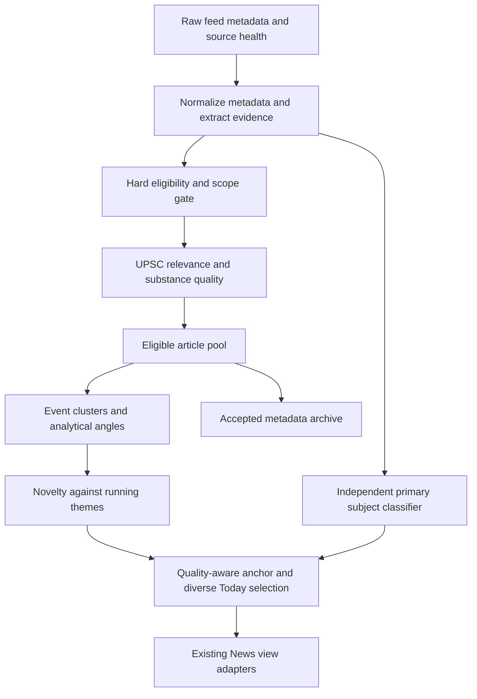

# TARS News Validator v3: architecture specification

Status: planning only. Prepared 2026-10-07 against local `atlas-news` HEAD `d21798db6212553e63420a8efd6e1f71c87417d9` plus the existing working tree. No implementation, source additions, corpus generation, commit or publication is authorized by this document.

Companion documents: [evaluation contract](EVALUATION_SCHEMA.md) and [isolated implementation jobs](WORK_PACKAGES.md). All proposed module paths below are future work, not existing implementations. Numeric v3 settings are proposed defaults to preregister and validate, not measured results.

## 1. Objective and fixed boundaries

Build a deterministic, metadata-only editorial pipeline that admits substantive UPSC/UPPCS material, assigns its actual primary subject, protects valuable analysis, and avoids repeated coverage crowding out other useful reading. Separate acceptance from classification, duplicate grouping, saturation and presentation selection.

The owner clarified foreign coverage: exclude country-specific news without evidenced impact on India; retain globally applicable science/environment knowledge even when produced abroad. Apply this to every country, including the US. A foreign publisher, foreign dateline, NASA attribution or a World section is neither a rejection nor an IR classification by itself.

Preserve:

- Atlas, News and Settings; bundled physical cartography, source facts/citations and stable place/question IDs.
- The four README identifiers: `lodestar`, `lodestar-study`, `app.lodestar.study`, `lodestar://`; existing sync identifiers and wire formats also remain intact.
- `src/data/compatibility`, historical opaque records, personal URL identities, Read/Saved/Removed state, dormant notes and backup round-trips. No destructive migrations or store resets.
- Registry-only feed access, bounded shard fetching, two-hour feed cache semantics, manual refresh, stale/offline recovery and Access authentication. No refresh caused solely by navigation.
- Article policy: feed metadata only for validation; no article fetching, bulk reading, prefetching, body caching or body persistence. The existing signed-in reader may fetch one permitted article only when opened. Restricted/refusing publishers remain restricted. The two fallback links and synced smry.ai counting remain unchanged; v3 never fetches, proxies or embeds that service.
- Current UI interaction and Today capacity of at most 100 reading units unless separately changed. Fewer strong items are preferable to a filled list of weak items.

No paid model/API or local-model dependency. No embeddings, article summaries generated by AI, network classification or nondeterministic inference. This design does not require any AI runtime.

## 2. What inspection established

| Current boundary | Evidence in this checkout | Consequence for v3 |
| --- | --- | --- |
| Registry | `src/current-affairs/sources.ts`: 77 enabled feeds; IE UPSC, Explained and editorials; TH Science, Environment and editorials. No dedicated IE columns/general opinion feed, TH general columns/op-ed feed or IE Science feed entry. | Audit discovery separately from rejection. Editorial feeds cannot be assumed to contain all columns. Do not invent new endpoint URLs. |
| Feed metadata | `feed.ts`: up to 200 entries/feed, title capped at 400 characters, description at 600; no bylines/categories retained. `dedupeUrls` keeps the first occurrence. | Preserve all source memberships before URL deduplication; recover available byline/category metadata. An earlier general feed can otherwise erase a later Explained section. |
| Validator | `relevance.ts`: weighted concept, recurrence, framing, source and setting evidence; score threshold 6.5 followed by substance/party-voice checks. Subjects come from the ordered relevance concept hits. | Acceptance and subject must have independent contracts. Replace broad lexical vetoes with dominant-purpose rules. |
| Political and foreign logic | `evidence-lexicon.ts` includes party names in positive India anchors; politics is partly a subtractive penalty. Foreign handling discounts concepts, with a US-specific rule and broad international/scientific exceptions. | Party identity contributes zero positive relevance. Country relevance becomes an explicit jurisdiction/impact gate. |
| Derived index | `public/current-affairs/v2/relevance-index.json`: 191 signals, no context entries. Polity 45, Economy 65, Sci-Tech 5, Environment 7, Security 19; concepts differ greatly in breadth. NASA is an alias of Space exploration; Hormuz a tier-3 Geography anchor. | Counts indicate vocabulary shape, not measured subject coverage. Do not use index subject or tier as article primary subject. |
| Index provenance | `tools/current-affairs/build-relevance.mjs`, `lexicon.mjs`, `match.ts`: lexical document frequencies; 3,896 CSE + 1,196 UPPCS Prelims and 1,130 GS Mains questions. Existing local builder change explicitly pins News to canonical release 2.1.0. | Preserve source pins and mechanical counts. Vocabulary expansion must not manufacture exam recurrence. Canonical Atlas supplements are out of scope. |
| Clustering | `cluster.ts`: weighted cosine/centroid merges, counterpart guards, digest isolation, 18-hour cross-midnight gap/48-hour span, five displayed members; an additional 7.2 single-publisher acceptance bar. | Remove hidden acceptance decisions from clustering. Distinguish event identity from multi-day theme saturation. Keep useful counterpart/digest safeguards. |
| Anchors/ranking | `cluster.ts` and `topics.ts` prefer TH/IE before information value. `workspace.ts` rewards publisher counts and recurrence again. `topics.ts` groups by first static anchor. | One quality-aware anchor selector; no publisher-volume relevance bonus; theme IDs separate from static links. |
| Pipeline/storage | `useFeeds.ts` → `useNewsModel.ts` → `useArchive.ts` → clustering/workspace/`readingScopes`/`groupTopics`. Archive writes accepted articles; Saved items have a fallback via `usePinned`. | Keep accepted, suppressed and saved-only states explicit. Retain useful metadata before Today selection. |
| Evaluation | `relevance-cases.json` has 256 cases, no URL/date/byline/subject gold. `substance-cases.json` has 11 flagged negatives. `audit.ts` sweeps thresholds on the same fixture and matches feed labels by title. | Existing cases are regression evidence, not an untouched validation set. Need raw-feed sampling, immutable IDs and temporal evaluations. |

Read-only baseline calculation during this inspection: the current `classify` accepts 120/133 relevant, 3/91 not-relevant and 7/32 borderline fixture items. On the 224 resolved binary labels, that is 97.6% precision and 90.2% recall **at article acceptance only**. It does not measure Today recall, subject accuracy, missing-source coverage or future performance. The cached snapshot contains 3,923 items dated 2026-10-05 with 77 source successes; it is historical, not a live health check.

`docs/VERIFICATION.md` records earlier figures including 110/133 relevant and 1/92 negative feed outcomes, plus historical application/browser checks. Their scope/date and label population differ from the current calculation. Neither those checks nor known-error exemptions in `relevance.test.ts` establish v3 quality. No v3 performance or accuracy is claimed.

## 3. Architecture and stage contracts

Recommended new boundary: `src/current-affairs/validator-v3/`. Pure functions share an immutable evidence record; they do not call one another's scoring logic. The orchestrator passes explicit policy, source/author/index versions, evaluation clock, timezone and metadata history. Only adapters read storage or fetch feeds.

Every stage returns stable reason codes and pointers to exact metadata evidence, including field and text offsets where applicable. Human-readable reasons are presentation, never an input to another stage. A policy ID and input digest accompany each run; a result is reproducible from metadata, versions and an explicit clock.

| Stage / proposed module | Input | Required output | Prohibited dependency |
| --- | --- | --- | --- |
| 0 `normalize.ts`, `evidence.ts` | Feed observations and frozen registries/index | `ArticleEvidence`: canonical URL, metadata revision hash, source memberships, title/summary, provenance, byline candidates, content type, jurisdiction, concept mentions with roles, actions/objects, dates and uncertainty | Article bodies; network enrichment; final labels |
| 1 `eligibility.ts` | Evidence + scope/noise policy | `EligibilityDecision`: `eligible`, `reject` or `insufficient_metadata`; reason codes; party-politics flag; impact/global-knowledge evidence | Relevance score, publisher preference, author prestige, subject assignment, available slots |
| 2 `relevance.ts` | Evidence + eligible decision + syllabus index | `RelevanceDecision`: `must_read_candidate`, `useful`, `below_floor`; separate dimensions and quality tier; exact support | Predicted primary subject, duplicate volume, saturation, final position |
| 3 `subject.ts` | Evidence + subject rules | `SubjectDecision`: one primary or `Unresolved`; optional secondary tags; confidence/margin and evidence | Acceptance flag, relevance total, source popularity, author identity |
| 4 `events.ts` | Accepted articles + event evidence | Events containing reports of the same development; separate analysis angles; all member identities; match/cannot-link reasons | New acceptance threshold or removal of unique-source articles |
| 5 `novelty.ts`, `themes.ts` | Events/angles + prior metadata + explicit clock | `new_development`, `distinct_analysis`, `repeat`, `uncertain`; theme key, prior match, material delta and history coverage | Publisher-count bonus; merely different words or updated timestamp |
| 6 `anchors.ts`, `select.ts` | Qualified units, subjects, novelty, explicit capacity | Today order, primary article, alternatives, archive-only reasons, supply/distribution diagnostics | Rescuing rejected articles or changing primary subjects to meet diversity targets |
| 7 `adapter.ts` | v3 results + existing view/personal-state inputs | Existing News view structures and separate v3 diagnostics | Rewriting URL state, historical rows or article access rules |

Author/source intelligence is evidence enrichment, not a sixth acceptance score. A run-level diagnostics record counts observations, unique URLs, parsing losses, eligibility reasons, relevance losses, unresolved subjects, merges, saturation losses, final positions and source failures. Stage totals reconcile to input identities.

### Metadata contract and uncertainty

- Keep stable canonical URL as personal-state identity; a content hash identifies a metadata revision, not a replacement article ID. Preserve original feed text verbatim in bounded metadata fields. Normalized matching text is derived separately.
- Add optional source memberships, feed categories and bylines with provenance (`rss:dc:creator`, RSS author, Atom author or a verified feed-specific mapping). Missing fields in old cache/archive rows mean unknown. Do not infer an author from a name mentioned in the headline or their usual subject.
- Same-URL observations merge deterministically: retain memberships, prefer valid publisher-provided metadata over empty values, record conflicting observations and never combine unrelated snippets into invented prose. Preserve the existing safe URL canonicalization; do not add aggressive path/query rewriting without alias evidence.
- Content type is `news_report`, `explainer`, `editorial`, `column`, `analysis`, `digest`, `interview`, `official_release`, `other` or `unknown`. Source section helps; it is not an unconditional truth label. Editorial and column remain distinguishable where metadata permits.
- Evidence distinguishes entity mention, dominant issue, policy/action, actor, affected object and jurisdiction. Repeated mentions count once per dimension. Broad aliases and ambiguous acronyms cannot establish dominance alone.
- `insufficient_metadata` is not a factual claim of irrelevance. Keep it in diagnostics and bounded raw snapshots, exclude it from the main recommended list, and reevaluate only when a normal feed refresh supplies richer metadata. It counts as a miss on a gold positive. No hidden article-fetch fallback.

## 4. Eligibility and relevance

### Hard gate: primary purpose, not keyword presence

Reject articles primarily about campaigning, candidates, seat-sharing/alliance arithmetic, party strategy, personalities, horse-races, accusations, partisan reactions or speech coverage without a substantive development. The rule applies equally to named and curated authors and all publishers.

An institutional constitutional/legal/policy development stays eligible when political actors are incidental. Determine whether the article's main proposition is an institutional action/analysis or a party's reaction to it. A court keyword in a campaign summary does not rescue a reaction. A party name in a judgment headline does not reject the judgment. Allow analytical columns about constitutional institutions and democratic structures; reject tactical commentary about party prospects.

Examples are policy tests, not invented news records:

| Main proposition | Gate result |
| --- | --- |
| Party demands resignation after ECI order | Reject party reaction |
| Court invalidates electoral rule in petition filed by a party | Eligible institutional action |
| Analysis of judicial independence and electoral legitimacy | Eligible analysis with syllabus evidence |
| Why a party's candidate strategy may win seats | Reject campaign analysis |
| Recruitment advertisement; horoscope; product deal; routine scores | Reject dominant noise |
| Sports governance law; AI personality-rights judgment | Eligible if policy/legal question dominates, despite sports/celebrity words |
| Routine local outage, company promotion, isolated crime | Reject absent substantive public-policy/systemic development |
| Defence doctrine, capability gap or cyber infrastructure assessment | Eligible Security analysis; do not require a new law or a second publisher |

Party names themselves contribute zero positive syllabus, India-impact or substance points. They can identify actors and party-politics evidence. Contextual terms such as anti-defection law or political funding may still supply institutional relevance. Resolve collisions such as US Congress vs Indian National Congress, CPI inflation vs CPI(M), UP vs “picking up”, generic pipeline vs energy pipeline, and Security as an organisation name vs a security issue.

### Country scope

Assign one scope reason: `india_domestic`, `india_impact`, `global_knowledge`, `foreign_domestic_no_impact`, or `unknown`.

- `india_impact` needs a metadata-supported mechanism: Indian trade/energy exposure, border or maritime security, diaspora consequences, treaty obligations, supply chains or relevant international governance. A country/place/person mention alone is insufficient. “International” is not a universal bypass.
- `global_knowledge` requires a substantive transferable science/environment finding, explanatory mechanism or genuinely global public-good/governance issue. NASA discovery can pass; NASA staff politics cannot. A local foreign climate lawsuit or campus award is still country-specific unless the metadata establishes wider consequences.
- Where a curated contextual impact rule is needed, it must name the mechanism and carry a maintained source reference/version. Do not assume every conflict, foreign election or bilateral negotiation affects India. Unestablished impact yields `insufficient_metadata`, not fabricated relevance.
- Apply the same policy to domestic US, UK, China and every other country. Foreign elections do not become eligible just by being classified IR. India-facing outcomes may qualify, while campaign horse-race reports do not.

### Relevance ranking after eligibility

Use independently explainable dimensions: syllabus connection, institutional/systemic consequence, explanatory depth, significance of finding/development and bounded PYQ support. Use ordinal quality tiers before fine ordering: exceptional, strong, useful, below-floor. A mapping table in versioned policy fixes feature weights, caps and cutoffs during development; no universal v2 score conversion is implied.

- A supported syllabus mechanism or institutional issue can qualify without a past-paper lexical hit. An old frequency-heavy concept cannot compensate for no substantive article purpose.
- PYQ recurrence is bounded supporting evidence, counted once; distinguish taxonomy linkage, editorial vocabulary and actual lexical document frequency. Do not call frequency an exact question-topic mapping or predicted exam probability.
- Explanatory substance can be a clear thesis or causal/policy analysis, not only a new order/report. This protects opaque-headline editorials and Security columns with meaningful summaries.
- Source section/content type can establish the nature of the piece, but source reputation and curated author status cannot independently clear the floor or confer `must_read_candidate`.
- Missing description is unknown depth, not poor writing. Long descriptions, photographs and repeated keywords do not independently improve quality.
- No special 7.2 gate for single-publisher stories. Every admitted article clears the same substantive standard; exclusive reporting and columns need no corroborating publisher. Syndicated volume contributes no relevance points.
- `must_read_candidate` requires exceptional consequence or insight supported by metadata. The final must-read badge is derived from this contract, not the old `MUST_READ_THRESHOLD` or generic author reputation.

The existing 6.5/7.2 thresholds stay in the v2 baseline during development. Replacing their semantics happens only at the gated v3 integration step; do not loosen legacy numbers to make an intermediate test pass.

## 5. Independent primary subject

Retain existing labels: Polity, Governance, Economy, International relations, Security, Sci-Tech, Environment, Geography, History & Culture. UPPCS focus and Prelims/Mains demand are separate dimensions. `Unresolved` is an explicit abstention, displayed using an existing neutral/general bucket rather than a guessed specialist subject.

Determine the central question the piece answers, using dominant concepts and action-object framing in the headline and summary. Section and specific feed categories provide bounded supporting evidence. “World”, “National” and country names provide no subject default. An index anchor is a static learning link, not a classification instruction. Curated author identity is not a subject vote.

Require either one unambiguous dominant frame or mutually supporting signals; use a preregistered top-two margin for confidence. On conflict, examine issue/action/object evidence, then specific section support. Abstain when neither dominates; do not break a semantic tie alphabetically. Secondary tags cannot replace the primary or route national party stories into IR.

| Dominant treatment | Primary | Supporting/secondary possibilities |
| --- | --- | --- |
| NASA telescope findings, space instrumentation, scientific mission | Sci-Tech | Static space/geography links as appropriate |
| NASA-related diplomatic treaty with an evidenced India dimension | International relations | Sci-Tech |
| NASA personnel controversy with no global knowledge/India impact | Classify independently if possible; reject at gate | No scientific acceptance bypass |
| Hormuz blockade, deterrence, naval capability/protection of Indian shipping | Security | IR; Geography static anchor |
| Hormuz diplomacy, sanctions bargaining and India-facing geopolitics | International relations | Security; Geography static anchor |
| Hormuz disruption primarily explaining Indian inflation/energy costs | Economy | IR |
| How a strait forms; bathymetry/physical setting | Geography | No automatic Security tag |
| Constitutional powers, rights, electoral law or ECI autonomy | Polity | Governance |
| Implementation and delivery of public services | Governance | Polity/Economy only if supported |
| Defence readiness, border management, cyber/critical infrastructure, terror financing mechanism | Security | IR/Economy as secondary |
| Ecological findings, biodiversity, climate mechanisms and impacts | Environment | Sci-Tech/Geography |
| Domestic party attacks about a foreign visit | Independent diagnostic label; rejected | World names cannot turn it into eligible IR |

Each article retains its own primary subject. An event may inherit the representative report's subject only when members share its treatment. Distinct analytical treatments remain separate reading units linked to the event/theme. Changing the anchor must not erase members' classifications. Default subject sections use primary subject only; any “related subjects” filtering must be explicit and must not double-count units in distribution metrics.

## 6. Source, publisher and author intelligence

Job B must build a coverage matrix for IE UPSC/Explained/columns/Science, TH columns/editorials/Science/Environment/analysis and Security/IR/Economy. Measure discovery, metadata sufficiency, acceptance and visibility separately. For PB Mehta and C. Raja Mohan, first establish whether expected columns arrive at all; never claim a classifier fixes a feed-discovery gap.

Curated author registry entries contain stable author ID, canonical name, verified aliases, publisher binding, evidence URL, review date and active status. Seed the requested names, Pratap Bhanu Mehta and C. Raja Mohan, only with verified alias/provenance records in Job B. Recognize feed bylines, not arbitrary text mentions. Multi-author columns are supported. No name-substring matching, honorific collisions, fabricated bylines or inferred authorship from subject matter.

Author handling protects recall through discovery monitoring, content-type evidence and a bounded ordering preference among substantively comparable analyses. It cannot override party/noise/foreign gates. Unknown authors are not penalized; useful specialist analysis must pass without a famous byline.

New feeds must be publisher-supported and verified with the existing parser/request limits on repeated observations; record overlap, freshness, byline yield, substantive yield and failures. Keep the registry below its current 100-source ceiling (maximum 99). Do not guess endpoints, scrape full articles for discovery, add a paid service or bypass refusals. Where legitimate feed metadata is unavailable, report the unresolved coverage gap.

### One anchor policy everywhere

Quality-first, then strong TH/IE preference within comparable coverage:

1. Restrict the candidate set to individually accepted articles covering the same development or the same analytical need. Exclude a brief that lacks the material development from comparison with an explanation of it.
2. Establish the highest substantive quality tier and its best evidence score. Retain candidates within that tier and a calibrated tolerance of that **fixed best score**. A lower tier or a score outside tolerance is materially weaker. Fix tier/tolerance rules before holdout.
3. If any candidate in that comparable set is TH or IE, choose from TH/IE. This preference is mandatory for comparable quality; it is not a small bonus that syndication volume can overwhelm.
4. Within that set use relevant depth/completeness of metadata evidence, specific coverage fit, then bounded author preference for analysis, publication time and canonical URL as stable tiebreaks. TH and IE have equal publisher preference. Do not use body length or reader accessibility as invented quality.
5. If another publisher is materially stronger, it wins and TH/IE remains an alternative. Record `materially_stronger_alternative` with the evidence difference.

Select against the fixed best candidate rather than an epsilon pairwise sort comparator, which can be non-transitive. Reuse this selector for event primaries and topic-group anchors. A topic-group anchor must not hide a distinct must-read development or analysis; split the visible group when needed.

## 7. Event identity and running-theme saturation

Maintain three different identities:

- Article: canonical URL; metadata revisions are separate observations.
- Event/development: actors, action, affected object, jurisdiction/counterparts, and anchored event/report/order date when supplied.
- Theme: issue/policy/conflict plus jurisdiction and relevant institution, spanning events. “SIR in jurisdiction X” is a theme; “ECI” alone is too broad. Two unrelated ECI actions must not share a saturation bucket by institution alone.

Clusters use deterministic entity/action candidate blocking, lexical similarity and explicit cannot-link constraints. Similar words/concepts are supporting evidence, never sufficient alone. Preserve counterpart checks (India–EU versus India–US), different judgments/datasets/report periods, digest isolation and no bridging through generic courts or shared numbers. Do not chain unrelated events through centroids. Unknown event date is not invented from publication date. Undated articles remain independently discoverable and cannot refresh Today.

Represent analytical angles separately from factual developments, with evidence such as legal reasoning, economic transmission, strategic capability, scientific mechanism or implementation impact. A genuinely valuable explanation/column can accompany the event report. The word “opinion”, another author or a different publisher does not itself establish a distinct angle.

### Deterministic temporal replay

Proposed history horizon: 14 days of accepted metadata, with a seven-day rolling theme comparison and a 24-hour Today window. Keep these as named policy parameters to validate in sequential replay.

- Derive history from existing metadata archive/cache, using publication time and first-seen observations where available. Never use Read/Saved actions as implicit relevance or saturation truth. No new synced novelty ledger is required.
- Replay in chronological buckets at a frozen `now`, using only metadata available at each cutoff. Compute editorial opportunities from the pool, not from whether a particular user opened News. Distinguish stored history coverage from source outage and a new installation.
- Stable metadata observations/first-seen times prevent an updated timestamp or repeated poll from making an old story new. A substantive same-URL update can earn new-development status when its metadata establishes a material delta.
- Cold start computes same-window deduplication and marks multi-day novelty confidence limited. Do not pretend to know articles the device never observed. Devices with different raw histories may legitimately differ; identical histories/versions/clock must produce identical results.
- Initially derive fingerprints in memory from bounded history. If caching is needed after profiling, use disposable, version-keyed derived data; no personal-state/schema migration. Invalid derived data rebuilds without erasing archive rows.

### Admission to Today, separate from acceptance

For each theme, select one representative per material development and normally one valuable complementary analytical angle in a rolling 24 hours. Additional same-theme units need a documented material development or distinct high-value angle. An exceptional judgment/report/major development cannot be blocked by a numerical theme limit; record the override. Broad theme membership alone is never a hard suppression rule.

Material deltas include a new judgment/order with changed legal effect, implemented policy change, official report/data point with a distinct period/result, new India-facing consequence, or a meaningfully different analytical thesis. Repeated reactions, procedural listings with no consequence, refreshed timestamps, new publishers and paraphrased recaps are not deltas. “Court” or “report” is not proof of importance.

`repeat` units remain accepted metadata and accessible in Archive/search/related coverage; they are not shown as new Today opportunities. `uncertain` delta cannot be claimed as novel: where there is already a strong representative, retain the candidate in Archive/alternatives; where no representative exists, an independently strong item may appear with uncertain novelty recorded. Measure the resulting misses.

Do not retain the current “newest report always displayed” behavior when the newest is a redundant repeat. A material newer development must remain visible, including when it arrives from a sixth publisher. Keep at most five displayed alternatives per existing group while preserving every URL and archive record; full membership participates in state and diagnostics before display truncation.

## 8. Final ranking and diversity

Apply final selection only after article quality and novelty decisions:

1. Form qualified reading units (material developments and valuable analyses), choose anchors with the shared policy, and collapse equivalent coverage.
2. Order by must-read significance, substantive quality tier, relevance within tier and material novelty. Do not add publisher-volume or duplicate-count bonuses.
3. Within a preregistered comparable-quality band, greedily prefer an underrepresented primary subject, then an underrepresented useful content type/angle. Recompute after each pick using stable tiebreaks. Protect Security, IR, Sci-Tech, Environment and Economy against crowding by repetitive Polity without inventing weak substitutes.
4. A soft subject-share target may trigger this comparison; it never rejects an exceptional unique development or pulls a below-floor candidate into the list. Choose its parameter on development/validation data, report overrides and quality regret. Do not hardcode a minimum count per subject or ban Polity.
5. Apply the existing maximum 100 units; every quality-qualified non-selected unit retains a reason (`repeat`, `capacity`, `comparable_quality_diversity`, etc.) and remains reachable in Archive. Ranking after personal filters must not refill with rejected or repeat material.

Preserve high-value classes by explicit monitoring, alternative pathways for analysis and comparable-quality selection, not by unconditional quotas. Distinct must-read analyses must not count as “recalled” merely because another publisher's brief about the topic is shown. Evaluate top-level visibility separately from expanded alternatives.

## 9. Invariants and integration guardrails

Acceptance invariants:

- Every newly recommended article passes eligibility and substantive relevance individually, including alternatives. A cluster, publisher, author, source section or empty subject quota cannot rescue a rejection.
- Party-primary material and country-specific foreign material without impact cannot pass through a score bonus. Incidental party mentions do not veto institutional coverage.
- Classification cannot affect acceptance; acceptance cannot force a subject. Static anchors remain links and never determine primary subject automatically.
- A rare or single-source strong editorial, Explained, Science or Security item is not rejected for lack of recurrence/corroboration.
- No accepted-but-suppressed item is deleted; no rejected-but-saved historical item is destroyed. Saved-only fallback is explicitly outside new recommendation metrics and cannot re-enter Today merely because it is pinned.
- Same input observations, policy/index/registry hashes, history and clock yield identical decisions, IDs and ordering under feed permutations and repeat runs. New observations may change derived grouping but never personal URL identities.

Integrate through one `evaluateArticles`/`buildReadingSelection` orchestrator with a v2 compatibility adapter. Map legacy display fields explicitly; do not disguise new ordinal quality as the old 6.5 score or leave old `mustReadEvidence`, `storyValue`, `SOLO_STORY_THRESHOLD` and `topicOf` decisions active after v3 takes control. Version all verdict caches with policy/index/author/source hashes and all relevant metadata, including bylines and memberships.

Shadow v3 on the same local metadata snapshot first, with no duplicate fetching or extra archive writes. Keep v2 output reproducible for comparison and rollback. Switch production selection only after the frozen evaluation gates and application checks pass, under a separately authorized implementation job. Publication always needs explicit owner authorization.

Metadata additions must be optional and bounded across feed/cache/archive/pinned/backup adapters. Inspect exact allowlists before changing them; unchanged sync may omit nonessential v3 intelligence and rederive it locally. Do not let parsed feed bodies or `content:encoded` enter records under a “raw metadata” label.

## 10. Decisions and architectural risks

Resolved: deterministic metadata-only runtime; quality-qualified TH/IE preference; no party-identity relevance; country-specific foreign news needs evidenced India impact, with globally applicable knowledge retained; subject is independent; useful unique-source coverage survives; no weak quota filling.

Remaining product/acceptance decisions, with proposed defaults:

- Approve the numerical quality gates and minimum sample sizes in `EVALUATION_SCHEMA.md` before tuning. They are targets, not achieved performance.
- Author registry initially covers the two requested columnists; additional authors require named, sourced entries, not an inferred whitelist.
- Use seven-day saturation comparison with 14-day metadata context initially; validate whether long legal/policy themes need a longer horizon.
- Retain the 100-unit ceiling and neutral unresolved-subject bucket. Any new review inbox, persistent cross-device novelty ledger or redesigned News sections needs separate scope.

Top risks: missing feed/byline coverage cannot be repaired by scoring; sparse summaries limit dominant-purpose and novelty detection; a vocabulary/PYQ imbalance can reappear as subject bias; broad theme matches can suppress material developments; source preference can hide stronger work without explicit quality comparisons; publisher duplicates can masquerade as corroboration; hidden holdout leakage can give false confidence; archive history and mixed cached registry generations can undermine deterministic replay. Jobs and evaluations below address each without changing the protected product/storage boundaries.
